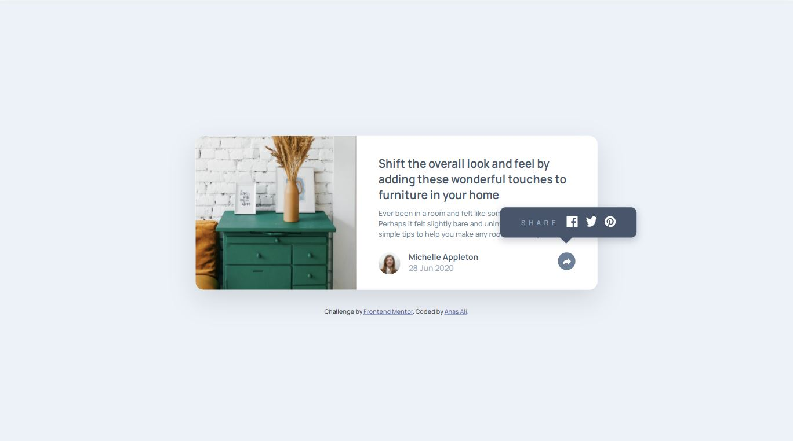

# Frontend Mentor - Article preview component solution

This is a solution to the [Article preview component challenge on Frontend Mentor](https://www.frontendmentor.io/challenges/article-preview-component-dYBN_pYFT). Frontend Mentor challenges help you improve your coding skills by building realistic projects. 

## Table of contents

- [Overview](#overview)
  - [The challenge](#the-challenge)
  - [Screenshot](#screenshot)
  - [Links](#links)
- [My process](#my-process)
  - [Built with](#built-with)
  - [Useful resources](#useful-resources)
- [Author](#author)
- [Acknowledgments](#acknowledgments)

## Overview
here is my solution for the challenge, learned alot about helper classes and absolut positioning.
### The challenge

Users should be able to:

- View the optimal layout for the component depending on their device's screen size
- See the social media share links when they click the share icon

### Screenshot

### Links

- Solution URL: [https://github.com/anas-cd/article-preview-component](https://github.com/anas-cd/article-preview-component)
- Live Site URL: [https://anas-cd.github.io/article-preview-component/index.html](https://anas-cd.github.io/article-preview-component/index.html)

## My process

### Built with

- Semantic HTML5 markup
- CSS custom properties
- Flexbox

### Useful resources

- [css triangle](https://css-tricks.com/snippets/css/css-triangle/)

## Author

- Website - [still workin on it](https://anas-cd.github.io/)
- Frontend Mentor - [@anas-cd](https://www.frontendmentor.io/profile/anas-cd)
- Twitter - [@AnasCd](https://twitter.com/AnasCd)

## Acknowledgments

I used a really helpfull and simple boilerplate made by "coder-coder" for frontend development, here is the repo for it :

- coder-coder - [biolerplate](https://github.com/thecodercoder/frontend-boilerplate)
